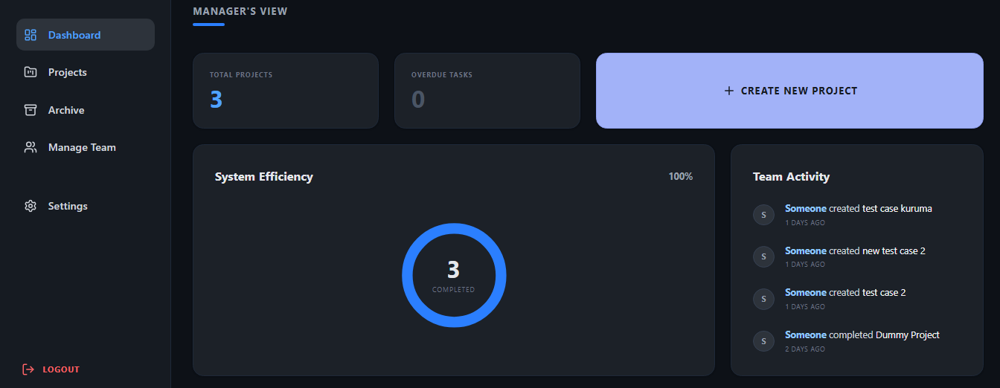
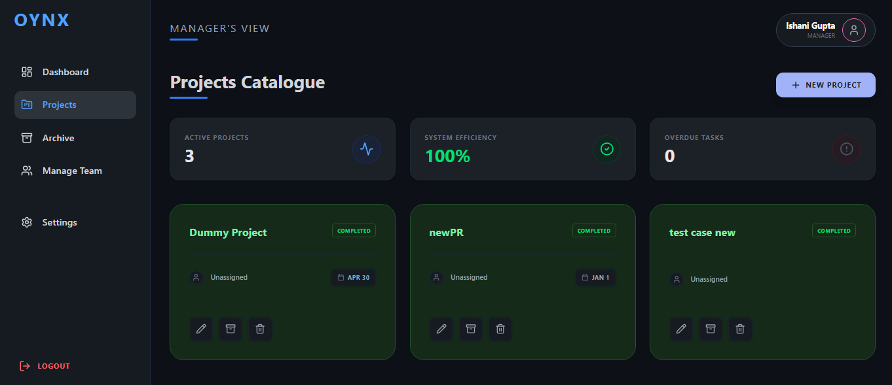
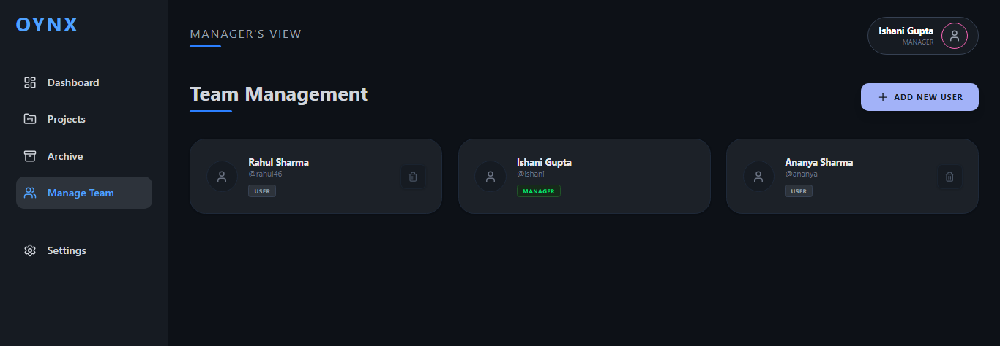
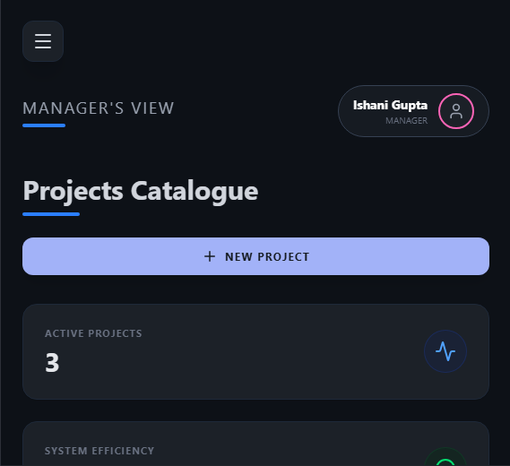

# 🚀 Oynx | Enterprise Project Management Dashboard

[](https://oynx-vu13.vercel.app/)
[](#-tech-stack)

**Oynx** is a full-stack, responsive project management and team collaboration dashboard . It features a real-time analytics engine, relational database architecture, and a modern, dark-themed user interface.

## 🌟 Key Features
* **📊 Live Analytics Dashboard:** Automatically calculates System Efficiency and overdue tasks, featuring a dynamic SVG circular progress ring and a real-time team activity feed.
* **📁 Project Catalogue (CRUD):** Complete project lifecycle management. Create, assign, edit, and archive projects seamlessly. Features dynamic color-coding for overdue tasks.
* **👥 Dynamic Team Management:** Relational database integration allows managers to add/remove team members and explicitly assign them to individual projects.
* **🔐 Secure Access:** Protected routing with a frontend authentication context and session persistence.
* **📱 Fully Responsive:** Adaptive layout with a mobile-friendly slide-out hamburger menu and responsive grid system.
* **🎨 Premium UI/UX:** Enterprise-grade dark mode interface built with Tailwind CSS, featuring custom deep-shade RGBA color palettes.

---

## 🛠️ Tech Stack
**Frontend:**
* [React.js](https://reactjs.org/) (Vite)
* [Tailwind CSS](https://tailwindcss.com/) (Styling)
* [Lucide React](https://lucide.dev/) (Icons)
* [React Router](https://reactrouter.com/) (Navigation & Protected Routes)

**Backend & Database:**
* [Vercel Serverless Functions](https://vercel.com/docs/functions) (`/api` routes)
* [Prisma ORM](https://www.prisma.io/) (Database Modeling)
* [Neon PostgreSQL](https://neon.tech/) (Cloud Database)

---

## 📸 Screenshots

| Manager Dashboard | Project Catalogue |
| :---: | :---: |
|  |  |

| Team Management | Mobile Responsive View |
| :---: | :---: |
|  |  |

---

## 🚀 Running the Project Locally

To run this project on your local machine, follow these steps. Note: You must use the Vercel CLI to properly run the backend API routes locally.

### 1. Clone the repository
```bash
git clone [https://github.com/09Ayush/oynx.git](https://github.com/09Ayush/oynx.git)
cd oynx
```

 ### 2. Install Dependencies
```bash
npm install
```

 ### 3. Environment Setup
Create a .env file in the root directory and add your Neon PostgreSQL connection string:
```bash
DATABASE_URL="postgresql://[USER]:[PASSWORD]@[HOST]/[DATABASE]?sslmode=require"
```     

### 4. Setup the Database (Prisma)
Push the schema to your database to create the necessary tables:
```bash
npx prisma db push
``` 
### 5. Install Vercel CLI (If not already installed)
Because this project relies on Vercel Serverless Functions, standard npm run dev will not execute the backend APIs.
```bash
npm install -g vercel
``` 

### 6. Start the Development Server
Boot up both the React frontend and Serverless backend simultaneously:
```bash
vercel dev
```
Open http://localhost:3000 to view it in your browser. Use the credentials manager / Oynx2026! to log in.

## 🔮 Future Scope
* **JWT Authentication:** Upgrading the frontend authentication to use secure, token-based backend verification using JSON Web Tokens.

* **Data Export:** Adding a feature to export project analytics and reports to .csv formats.

* **Role-Based Access Control (RBAC):** Creating distinct UI views for "Manager" roles versus standard "User" roles.

---

**Developed with ❤️ by Ayush Thakur.**